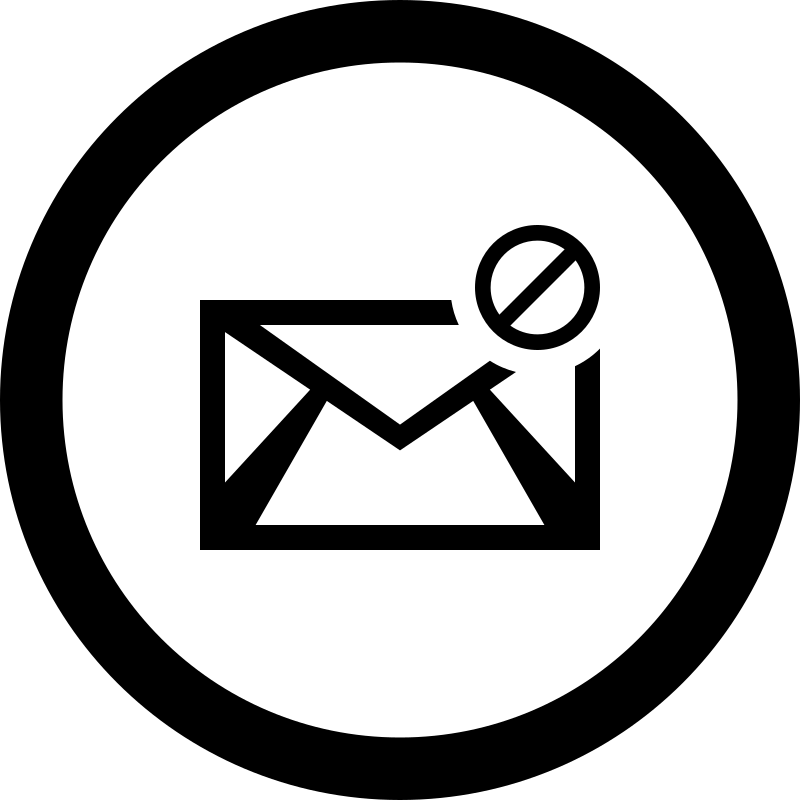
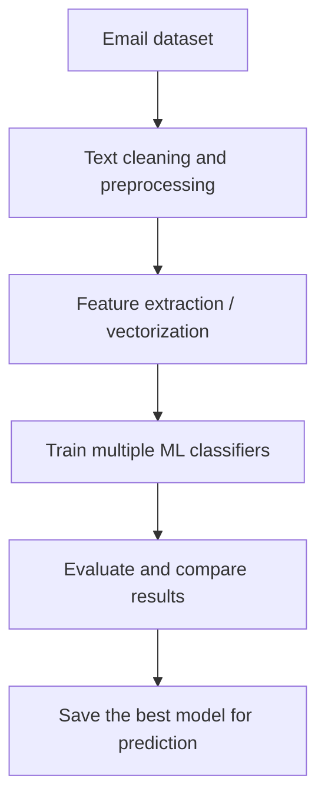

<p align="center">
  
</p>

<h1 align="center">Spam Email Detection using Machine Learning</h1>

<p align="center"><i>Spam and ham email classification with classical machine learning, preprocessing, and text feature extraction.</i></p>

<p align="center">
  
  
  
  
</p>

<p align="center">
  
  
  
  
</p>


## Table of contents

- [Project intro](#project-intro)
- [Dataset](#dataset)
- [Project structure](#project-structure)
- [Installation](#installation)
- [Tools](#tools)
- [Methodology](#methodology)
- [Results](#results)
- [Further reading & references](#further-reading--references)
- [License](#license)


## 📌 Project intro

This repository contains a spam email classification workflow that predicts whether an email is spam or ham based on its text features. The project uses classical machine learning models from scikit-learn, along with preprocessing and feature extraction, to turn raw email content into a binary classification problem.

The goal is to provide a compact, reproducible example of email spam detection that can be trained, evaluated, and compared across multiple classifiers.

> **Quick visual summary**
> - Focus: email text classification for spam detection
> - Approach: preprocessing + feature extraction + ML classification
> - Outcome: compare several models and identify the best-performing classifier
> - Dataset: email/spam datasets shared through Google Drive because the file is larger than 25 MB


## 📊 Dataset

The repository includes spam and ham email datasets under the `Datasets/` folder.

- `Datasets/mail_data.csv`
- `Datasets/spam.csv`
- `Datasets/spamham.csv`

Dataset download link: [Google Drive folder](https://drive.google.com/drive/folders/1uQhAePsAJmVBoIGsjlZXsc66UGB2ujP5?usp=sharing)

The data was cleaned and prepared before model training so the classifiers could learn from normalized, noise-reduced text features.


## 🗂️ Project structure

```txt
.
├── CSE_498_R_PROJECT.ipynb
├── Datasets/
│   ├── mail_data.csv
│   ├── spam.csv
│   ├── spamham.csv
│   └── spam_email dataset link
├── IMAGES/
│   ├── AdaBoostClassifier().png
│   ├── DecisionTreeClassifier().png
│   ├── DecisionTreeClassifier(criterion='entropy').png
│   ├── DummyClassifier(strategy='most_frequent').png
│   ├── GradientBoostingClassifier().png
│   ├── KNeighborsClassifier().png
│   ├── LogisticRegression().png
│   ├── MLPClassifier().png
│   ├── MultinomialNB().png
│   ├── RandomForestClassifier().png
│   ├── SVC().png
│   └── Number of spam and ham mail in dataset plot.png
├── Model Example/
│   └── model.pkl
└── README.md
```


### ✨ Project sections

| Feature | Description |
|---|---|
| Notebook | `CSE_498_R_PROJECT.ipynb` — interactive notebook for preprocessing and training |
| Preprocessing & Training | Reproducible pipeline for cleaning text and training multiple classifiers |
| Model Comparison | Side-by-side evaluation of classifiers with metrics and selection guidance |
| Visualizations | Plots and charts saved in `IMAGES/` for data exploration and model outputs |
| Saved Model | Serialized model available at `Model Example/model.pkl` for inference experiments |

### 🔄 Project flow



## ⚙️ Installation

```bash
git clone https://github.com/rootcode-creator/Detection-of-Spam-Email-using-Machine-Learning.git
cd Detection-of-Spam-Email-using-Machine-Learning
pip install numpy pandas scikit-learn matplotlib seaborn jupyter
```

If you want to open the notebook, launch Jupyter from the project directory and run `CSE_498_R_PROJECT.ipynb`.

## 🧰 Tools

- **Python:** primary language used for data preparation and model training.
- **Pandas / NumPy:** dataset loading, cleaning, and feature handling.
- **Scikit-learn:** model training, feature extraction, and evaluation.
- **Matplotlib / Seaborn:** visual analysis and dataset inspection.
- **Jupyter Notebook:** interactive experimentation and reporting.


## 🧪 Methodology

The project follows a standard machine learning pipeline for text classification:

1. Load the email dataset and inspect the label distribution.
2. Clean and preprocess the text data.
3. Transform email text into numerical features.
4. Train multiple classifiers such as Logistic Regression, Decision Tree, Random Forest, Gradient Boosting, AdaBoost, KNN, SVC, Multinomial Naive Bayes, and MLP.
5. Compare model performance and keep the best candidate for prediction.


## 📈 Results

The project compares several standard classifiers for spam detection. The images in `IMAGES/` show the model outputs and the label distribution, making it easier to evaluate which classifier performs best for this dataset.

Typical comparison points include:

- Accuracy and generalization across the test split
- Stability of tree-based models versus linear baselines
- Performance of Naive Bayes on text-style features
- Practical trade-offs between precision and recall for spam detection


## 📚 Further reading & references

- Kaggle dataset link included in `Datasets/spam_email dataset link`
- Scikit-learn documentation: https://scikit-learn.org/
- Pandas documentation: https://pandas.pydata.org/
- Jupyter documentation: https://jupyter.org/

## 📜 License

This project is intended for academic and educational use. Please credit the original dataset source and the libraries used if you reuse or extend the work.
